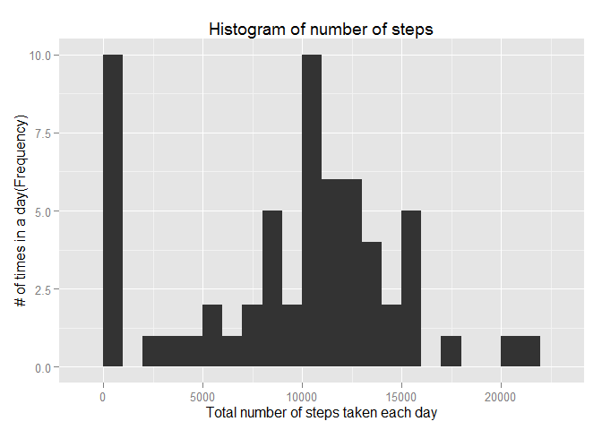

# Reproducible Research: Peer Assessment 1
## Set the environment and download the file for this project
## Loading and preprocessing the data

```r
library(knitr)
library(ggplot2)
library(lattice)
opts_chunk$set(echo = TRUE)
src <- "~/DataPA1/"
sfile <- paste(src,"activity.zip",sep="")
destfile=paste(src,"activity.csv",sep="")

# check the sources data folder exists
##unlink(src)
if (!file.exists(destfile)) {
  if (!file.exists(src)) {
    dir.create(src)
  }
  dir.create(src)
  setwd(src)
  cat("### downloading the file please wait..... ##\n")
  url<-'http://d396qusza40orc.cloudfront.net/repdata%2Fdata%2Factivity.zip'
  download.file(url,destfile=sfile)
  opts_chunk$set(echo = TRUE)
  unzip(zipfile=sfile)
  act_data <- read.csv(destfile)
  } else {
    setwd(src)
    opts_chunk$set(echo = TRUE)
    act_data <- read.csv(destfile)
}
```

```
## Warning in dir.create(src): '\\NJROS1NS03V1\X067867$\My Documents\DataPA1'
## already exists
```

```
## ### downloading the file please wait..... ##
```

## What is mean total number of steps taken per day?
1. Calculate the total number of steps taken per day
2. Make a histogram of the total number of steps taken each day
3. Calculate and report the mean and median of the total number of steps taken per day


```r
total_steps <- tapply(act_data$steps, act_data$date, FUN=sum, na.rm=TRUE)
##cat("Total steps per day",as.act_data.frame(total_steps),"\n")
# just x supplied = histogram
qplot(total_steps, binwidth=1000, xlab="Total number of steps taken each day", ylab="# of times in a day(Frequency)",main="Histogram of number of steps")
```

 

```r
mean_steps <- mean(total_steps, na.rm=TRUE)
med_steps <- median(total_steps, na.rm=TRUE)
cat("Mean steps per day",mean_steps, ", & Medean steps per day",med_steps," \n")
```

```
## Mean steps per day 9354.23 , & Medean steps per day 10395
```

## What is the average daily activity pattern?
1. Make a time series plot (i.e. `type = "l"`) of the 5-minute
   interval (x-axis) and the average number of steps taken, averaged
   across all days (y-axis)
2. Which 5-minute interval, on average across all the days in the dataset, contains the maximum number of steps?


```r
avr_steps <- aggregate(x=list(steps=act_data$steps), by=list(interval=act_data$interval),FUN=mean, na.rm=TRUE)
ggplot(data=avr_steps, aes(x=interval, y=steps)) +
    geom_line() +
    xlab("Interval(5 mins)") +
    ylab("On average number of steps taken")
```

 

```r
##Which 5-minute interval, on average across all the days in the dataset contains the maximum number of steps?
Max_stps <- avr_steps$interval[which.max(avr_steps$steps)]
cat("on average across all the days in the dataset, contains the maximum number of step is  ",Max_stps)
```

```
## on average across all the days in the dataset, contains the maximum number of step is   835
```


## Imputing missing values
1. Calculate and report the total number of missing values in the dataset (i.e. the total number of rows with NAs)

2. Devise a strategy for filling in all of the missing values in the dataset. The strategy does not need to be sophisticated. For example, you could use the mean/median for that day, or the mean for that 5-minute interval, etc.

3. Create a new dataset that is equal to the original dataset but with the missing data filled in.

4. Make a histogram of the total number of steps taken each day and Calculate and report the mean and median total number of steps taken per day. Do these values differ from the estimates from the first part of the assignment? What is the impact of imputing missing data on the estimates of the total daily number of steps?


```r
##missing_stps <- is.na(act_data$steps)
# How many missing
sum(is.na(act_data))
```

```
## [1] 2304
```

```r
##table(missing_stps)

replace.value <- function(steps, interval) {
    rtn_val <- NA
    if (!is.na(steps))
        rtn_val <- c(steps)
    else
        rtn_val <- (avr_steps[avr_steps$interval==interval, "steps"])
    return(rtn_val)
}
new_ds <- act_data
new_ds$steps <- mapply(replace.value, new_ds$steps, new_ds$interval)
cat("Missing data in new data set is ",sum(is.na(new_ds)))
```

```
## Missing data in new data set is  0
```

```r
total_steps.new <- tapply(new_ds$steps, new_ds$date, FUN=sum)
##cat("Total steps per day",as.act_data.frame(total_steps),"\n")
# just x supplied = histogram
qplot(total_steps.new, binwidth=1500, xlab="Total number of steps taken each day", ylab="# of times in a day(Frequency)",main="Histogram of number of steps(new dataset)")
```

 

```r
mean_steps <- mean(total_steps.new)
med_steps <- median(total_steps.new)
cat("New Data Set: Mean steps per day",mean_steps, ", & Medean steps per day",med_steps," \n")
```

```
## New Data Set: Mean steps per day 10766.19 , & Medean steps per day 10766.19
```


## Are there differences in activity patterns between weekdays and weekends?
## ------------------------------------------------------------------------
 For this part the weekdays() function may be of some help here. Use the dataset with the filled-in missing values for this part.

1. Create a new factor variable in the dataset with two levels - "weekday" and "weekend" indicating whether a given date is a weekday or weekend day.

2. Make a panel plot containing a time series plot (i.e. type = "l") of the 5-minute interval (x-axis) and the average number of steps taken, averaged across all weekday days or weekend days (y-axis). See the README file in the GitHub repository to see an example of what this plot should look like using simulated data.


```r
dayType <- function(date) {
    day <- weekdays(date)
    if (day %in% c("Monday", "Tuesday", "Wednesday", "Thursday", "Friday"))
        return("Weekday")
    else 
        return("Weekend")
    
}
new_ds$date <- as.Date(new_ds$date)

# Create a factor type days - week day or weekend

new_ds$dayType <- as.factor(sapply(new_ds$date, FUN=dayType))

avg <- aggregate(steps ~ interval + dayType, data=new_ds, mean)
xyplot(avg$steps ~ avg$interval | avg$dayType, avg, type = "l", layout = c(1, 2), xlab = "Interval", ylab = "Number of steps")
```

 


### End of assignment
